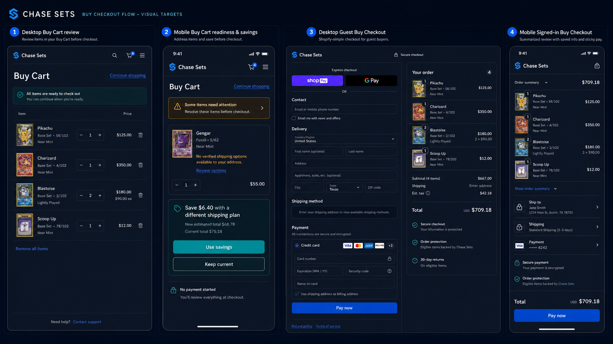
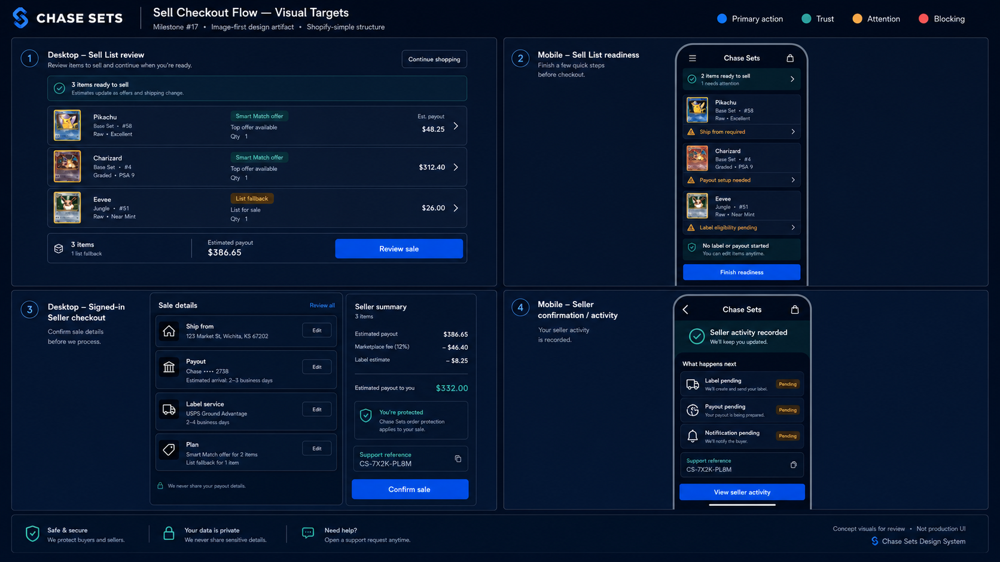
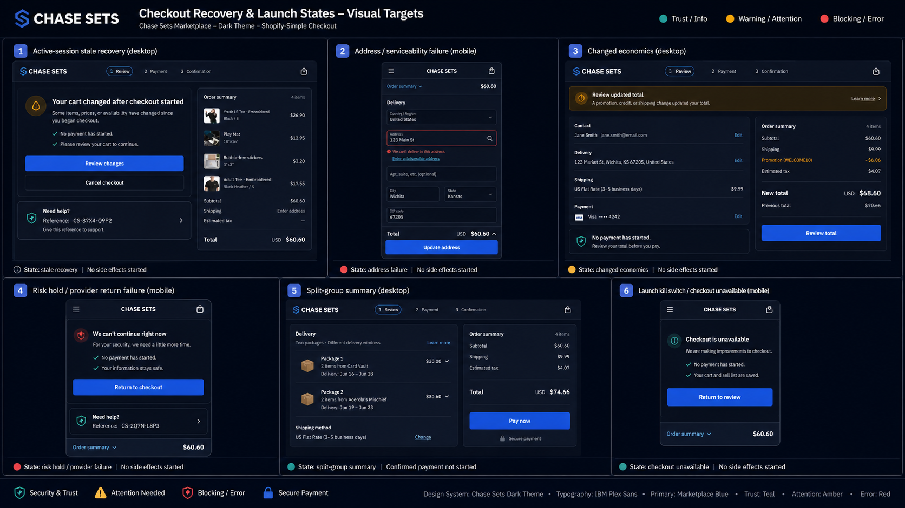
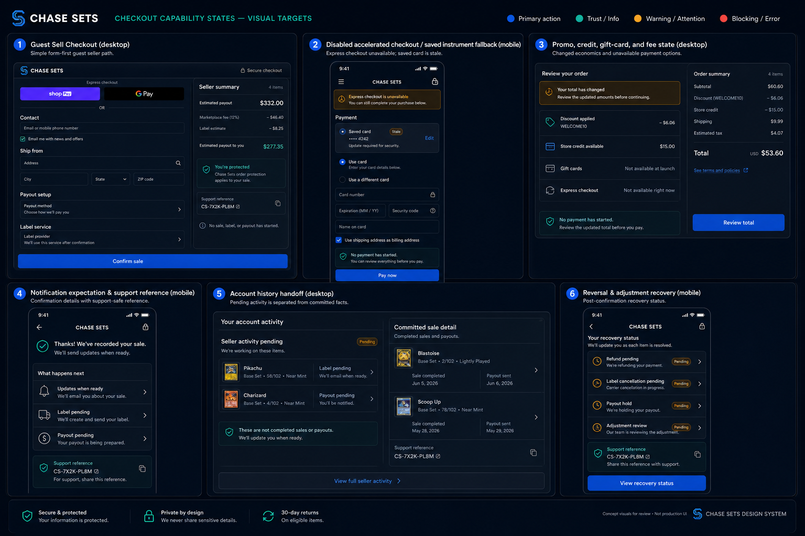

# Checkout Visual Targets

Milestone #17 uses image-first visual targets for the Shopify-simple Buy Cart and Sell List checkout rebuild. These targets are review artifacts, not production UI. Implementation PRs should either match an approved image target or attach a desktop/mobile screenshot with an explicit delta decision.

The executable contract lives in `bounded-contexts/checkout/features/sessions/api/checkout-visual-targets.ts`.

## Source References

The supplied Shopify/PokeBash screenshots remain the hierarchy reference set:

- `screencapture-pokebash-co-cart-2026-06-08-20_55_09.png`
- `screencapture-pokebash-co-checkouts-cn-hWND7gfApDDIyRwIKmWZGplZ-en-us-2026-06-08-20_51_29.png`
- `screencapture-pokebash-co-checkouts-cn-hWND7gfApDDIyRwIKmWZGplZ-en-us-2026-06-08-20_53_52.png`
- `screencapture-pokebash-co-checkouts-cn-hWND7gfApDDIyRwIKmWZGplZ-en-us-2026-06-08-20_54_20.png`
- `screencapture-shop-app-checkout-68792320022-cn-hWND7gfApDDIyRwIKmWZGplZ-en-us-shoppay-2026-06-08-20_50_58.png`
- `screencapture-shop-app-checkout-68792320022-cn-hWND7gfApDDIyRwIKmWZGplZ-en-us-shoppay-2026-06-08-20_52_52.png`
- `screencapture-shop-app-checkout-68792320022-cn-hWND7gfApDDIyRwIKmWZGplZ-en-us-shoppay-2026-06-08-20_53_19.png`

The Chase Sets targets adapt that hierarchy into the dark marketplace design-system theme: navy surfaces, restrained borders, marketplace-blue primary actions, teal trust cues, amber attention states, and red only for blocking states.

## Generated Image Targets

Repo path: `bounded-contexts/checkout/docs/visual-targets/checkout-visual-targets-buy-flow.png`

Repo path: `bounded-contexts/checkout/docs/visual-targets/checkout-visual-targets-sell-flow.png`

Repo path: `bounded-contexts/checkout/docs/visual-targets/checkout-visual-targets-recovery-launch.png`

Repo path: `bounded-contexts/checkout/docs/visual-targets/checkout-visual-targets-capability-states.png`

## Design Rules

- Cart/list review is separate from checkout.
- Unassigned fulfillment stays in Buy Cart or Sell List readiness. Checkout can summarize a ready plan, but it must not ask customers to solve fulfillment assignment.
- Optional savings optimization, including `Save $X`, stays in cart/list readiness or a conditional pre-checkout step.
- Desktop checkout uses a focused two-column form plus summary.
- Mobile checkout uses a single column, collapsible summary, and sticky primary action/total behavior.
- Signed-in checkout compresses saved information into editable rows.
- Recovery states use customer-safe language and show no-side-effect facts when no payment, order, label, payout, settlement, notification, account-history, support, reconciliation, refund, void, or reversal work started.
- Confirmation and account/history visuals distinguish pending Checkout activity from committed downstream facts.
- Visual targets forbid dense checkout panels, allocation controls, provider diagnostics, old-route recovery, legacy payload wording, hidden repair, nested card stacks, migration/backfill wording, and fake downstream completion.

## Visual Inventory

| Target | Image artifact | Frames | Copy surface | Performance surface | Launch decision |
| --- | --- | --- | --- | --- | --- |
| Buy Cart review ready | `checkout-visual-targets-buy-flow.png` | 1 Desktop Buy Cart review | `cart-list-review` | `cart-list-initial-render` | Not required |
| Buy readiness attention | `checkout-visual-targets-buy-flow.png` | 2 Mobile Buy Cart readiness and savings | `readiness-unassigned-fulfillment` | `buy-cart-readiness-evaluation` | Required |
| Buy readiness savings optimization | `checkout-visual-targets-buy-flow.png` | 2 Mobile Buy Cart readiness and savings | `readiness-optimization-offer` | `fulfillment-optimization-decision` | Not required |
| Guest Buy Checkout | `checkout-visual-targets-buy-flow.png` | 3 Desktop Guest Buy Checkout | `checkout-review` | `checkout-entry-review-render` | Not required |
| Signed-in Buy Checkout | `checkout-visual-targets-buy-flow.png` | 4 Mobile Signed-in Buy Checkout | `checkout-saved-info-rows` | `mobile-sticky-action-interaction` | Not required |
| Sell List review ready | `checkout-visual-targets-sell-flow.png` | 1 Desktop Sell List review | `cart-list-review` | `cart-list-initial-render` | Not required |
| Sell List readiness blocked | `checkout-visual-targets-sell-flow.png` | 2 Mobile Sell List readiness | `readiness-blocked-or-unavailable` | `sell-list-readiness-evaluation` | Required |
| Guest Sell Checkout | `checkout-visual-targets-capability-states.png` | 1 Guest Sell Checkout desktop | `checkout-review` | `checkout-entry-review-render` | Not required |
| Signed-in Sell Checkout | `checkout-visual-targets-sell-flow.png` | 3 Desktop Signed-in Seller Checkout | `checkout-saved-info-rows` | `checkout-entry-review-render` | Not required |
| Seller confirmation activity | `checkout-visual-targets-sell-flow.png` | 4 Mobile Seller confirmation/activity | `seller-pending-activity` | `final-confirmation-visible-state` | Required |
| Active-session stale recovery | `checkout-visual-targets-recovery-launch.png` | 1 Active-session stale recovery desktop | `active-session-stale-recovery` | `active-session-reload` | Required |
| Address or serviceability failure | `checkout-visual-targets-recovery-launch.png` | 2 Address/serviceability failure mobile | `address-correction` | `totals-refresh` | Required |
| Changed economics review | `checkout-visual-targets-recovery-launch.png` | 3 Changed economics desktop | `economics-discount-credit-promo` | `totals-refresh` | Required |
| Risk hold or provider-return failure | `checkout-visual-targets-recovery-launch.png` | 4 Risk hold/provider return failure mobile | `risk-hold-or-block` | `provider-return-confirmation` | Required |
| Split package summary | `checkout-visual-targets-recovery-launch.png` | 5 Split-group summary desktop | `split-group-summary` | `checkout-entry-review-render` | Required |
| Checkout unavailable | `checkout-visual-targets-recovery-launch.png` | 6 Launch kill switch/checkout unavailable mobile | `kill-switch-disabled-checkout` | `checkout-entry-permanent-recovery-render` | Required |
| Temporary recovery loading | `checkout-visual-targets-recovery-launch.png` | 1 Active-session stale recovery desktop | `checkout-temporary-recovery` | `checkout-entry-temporary-recovery-render` | Required |
| Disabled accelerated or saved instrument | `checkout-visual-targets-capability-states.png` | 2 Disabled accelerated checkout/saved instrument fallback mobile | `accelerated-saved-instrument-fallback` | `payment-payout-setup-handoff` | Required |
| Promo, credit, gift card, and fee state | `checkout-visual-targets-capability-states.png` | 3 Promo, credit, gift-card, and fee state desktop | `economics-discount-credit-promo` | `totals-refresh` | Required |
| Notification expectation and support reference | `checkout-visual-targets-capability-states.png` | 4 Notification expectation and support reference mobile | `notification-expectation` | `final-confirmation-visible-state` | Required |
| Account history handoff | `checkout-visual-targets-capability-states.png` | 5 Account history handoff desktop | `account-history-handoff` | `account-history-handoff` | Required |
| Reconciliation pending | `checkout-visual-targets-capability-states.png` | 5 Account history handoff desktop | `account-history-handoff` | `support-lookup` | Required |
| Reversal and adjustment recovery | `checkout-visual-targets-capability-states.png` | 6 Reversal and adjustment recovery mobile | `cancellation-refund-reversal` | `reversal-recovery-status-refresh` | Required |

## Delta Register

These targets are ready for design review; implementation can either match them or document a focused delta.

| Delta | Owner | Exit condition |
| --- | --- | --- |
| UI implementation must attach screenshots or match an approved image target. | #1115 | Desktop and mobile checks link the image target or explicit delta. |
| Customer-visible copy must map to the copy-policy surface. | #1102 | Localization keys and visual/copy deltas are reviewed together. |
| Pending states must stay separate from committed downstream records. | #1135, #1130, #1122 | Account/history/support visuals distinguish pending activity from committed order, sale, label, payout, settlement, notification, fulfillment, support, reconciliation, and reversal facts. |

## Review Use

Use these images as the first visual target set for #1112. Future implementation PRs should preserve the intent even when exact content changes:

- simple hierarchy over marketplace detail;
- visible totals, payment/payout status, support-safe references, and primary action;
- readiness before checkout;
- no side effects before valid confirmation;
- pending Checkout activity separated from committed downstream facts;
- no old checkout compatibility surfaces.
