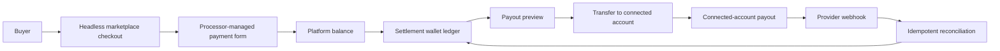

# Wallet, Payments, And Stripe Responsibilities

## Decision

Settlement owns wallet truth, seller payout setup state, payout requests, payout reversals, payout read models, and payout reconciliation decisions. Payments owns buyer payment intent state, balance-credit application, payment read models, and refund state. Stripe integrations stay behind provider adapters.

## Provider Boundaries

- `@chase-sets/payment-processing` defines the provider-neutral buyer payment processor port.
- `@chase-sets/money-movement` defines the provider-neutral seller payout and Connect money movement port.
- Fake adapters live in infrastructure testing packages.
- Stripe payment and Stripe Connect adapters live in infrastructure packages.
- Deployables compose adapters into bounded-context runtimes; bounded contexts do not own Stripe API request shapes.

## Risk And Data Handling

- Buyer card details are collected through Stripe.js Payment Element or another processor-managed form, not marketplace-owned inputs.
- Stripe.js must load from `https://js.stripe.com/v3/` so the processor can collect the browser and device signals used for fraud review.
- Buyer payments use automatic payment methods and automatic 3D Secure handling through the payment processor adapter.
- Seller payout destination, identity, and account requirements are collected through hosted Connect setup or account management.
- The marketplace stores provider references, statuses, and failure messages, not bank account numbers, tax identity details, or card data.
- Provider webhooks use raw-body signature verification and idempotent provider event recording before state transitions.
- Settlement fails fast when platform balance cannot support a payout request, and provider transfer or payout failures post a single wallet reversal.

## Operational Model

- Sellers see natural payout setup language and a single recovery action for incomplete or restricted setup.
- Sellers see pending balance, available balance, payout preview, estimated payout timing, and automatic reversal language before requesting a payout.
- Operators use payout operations filters and reconciliation to review stale requested payouts, in-transit payouts, failed payouts, and missing provider references.
- Operators with reconciliation permission can see support-safe diagnostics. Sellers do not need provider transfer or payout references in normal payout detail views.
- The platform API runs scheduled payout reconciliation by default. Set `PAYOUT_RECONCILIATION_INTERVAL_MS=0` to disable it locally.
- Stripe remains responsible for hosted onboarding, external payment destination collection, Payment Element handling, transfer execution, payout execution, and webhook signatures.

## End-To-End Money Flow

## Permissions

- `payouts.view`: view wallet, payout setup state, payout history, and payout details.
- `payouts.setup`: start hosted payout setup, manage payout account, and refresh setup state.
- `payouts.request`: preview and request on-demand payouts from available wallet balance.
- `payouts.reconcile`: view provider diagnostics and run payout reconciliation.
- `payouts.manage`: reserved for future operator override workflows.
