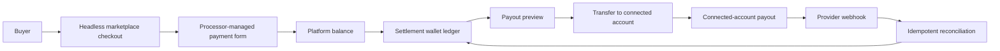

# Wallet, Payments, And Stripe Responsibilities

## Decision

Settlement owns wallet truth, seller payout setup state, payout requests, payout reversals, payout read models, and payout reconciliation decisions. Payments owns buyer payment intent state, balance-credit application, payment read models, and refund state. Stripe integrations stay behind provider adapters.

## Provider Boundaries

- `@chase-sets/payment-processing` defines the provider-neutral buyer payment processor port.
- `@chase-sets/money-movement` defines the provider-neutral seller payout and Connect money movement port.
- Fake adapters live in infrastructure testing packages.
- Stripe payment and Stripe Connect adapters live in infrastructure packages.
- Deployables compose adapters into bounded-context runtimes; bounded contexts do not own Stripe API request shapes.

## Risk And Data Handling

- Buyer card details are collected through Stripe.js Checkout Sessions with embedded Elements, Payment Element, or another processor-managed form, not marketplace-owned inputs.
- Stripe.js must load from `https://js.stripe.com/v3/` so the processor can collect the browser and device signals used for fraud review.
- Buyer payments use automatic payment methods and automatic 3D Secure handling through the payment processor adapter.
- Seller payout destination, identity, and account requirements are collected through hosted Connect setup or account management.
- The marketplace stores provider references, statuses, and failure messages, not bank account numbers, tax identity details, or card data.
- Provider webhooks use raw-body signature verification and idempotent provider event recording before state transitions.
- Settlement fails fast when platform balance cannot support a payout request, and provider transfer or payout failures post a single wallet reversal.
- Provider refund and dispute signals are recorded idempotently as support-safe events. V1 does not automatically mutate seller wallets from a raw refund or dispute webhook; settlement changes require an explicit refund/dispute workflow so ledger side effects stay auditable and cannot double-apply.

## Charge And Funds Strategy

- Buyer checkout creates one provider-managed payment session per internal payment, with wallet balance credit applied before the external payment amount is sent to the processor.
- Buyer checkout defaults to embedded processor-managed confirmation and can fall back to hosted Checkout with `STRIPE_CHECKOUT_UI_MODE=hosted`.
- Platform-held funds are intentional for v1: buyer payments settle to the platform balance, settlement records seller wallet credit, and money moves to the connected seller account only when the seller requests an on-demand payout.
- Seller sale credits are pending first. The default hold is two days, after which the internal funds release job marks matured sale credits available for wallet spending or payout.
- Do not mix direct connected-account charges, destination charges, and platform-held charges in the same seller wallet flow. A future charge strategy change should be a migration with explicit ledger and reconciliation rules.
- Payout requests transfer from the platform balance to the connected account first, then create the connected-account payout. The seller-facing source of truth remains the settlement wallet ledger.
- Stripe handles card collection, dynamic payment methods, 3D Secure, hosted onboarding, payout destination collection, transfer execution, payout execution, and webhook signatures. Marketplace code stores only provider references and support-safe statuses.

## Refund And Dispute Settlement Policy

- Refund requests are created through the payments context and executed by the payment processor adapter with deterministic idempotency.
- Stripe refund/dispute webhooks are recorded in the provider event inbox and shown as support-safe payment events.
- Seller wallet debits, seller reversals, buyer credits, and dispute adjustments must be posted by an explicit settlement workflow that can name the internal payment, orders, amount, and reason.
- A duplicate provider event must never post a second wallet adjustment. Provider event ids and idempotency keys are recorded before state transitions.
- Open dispute or refund operations should keep seller funds pending or block payouts until an operator workflow resolves the settlement action.

## Operational Model

- Sellers see natural payout setup language and a single recovery action for incomplete or restricted setup.
- Sellers see pending balance, expected availability for sale funds, available balance, payout preview, estimated payout timing, and automatic reversal language before requesting a payout.
- Sellers see actionable payout unavailable reasons for setup, stale setup status, provider requirements, and zero available balance.
- Operators use payout operations filters and reconciliation to review stale requested payouts, in-transit payouts, failed payouts, and missing provider references.
- Operators with reconciliation permission can see support-safe diagnostics. Sellers do not need provider transfer or payout references in normal payout detail views.
- The platform API runs scheduled payout reconciliation by default. Set `PAYOUT_RECONCILIATION_INTERVAL_MS=0` to disable it locally.
- The platform API scans stale payments with `PAYMENT_RECONCILIATION_INTERVAL_MS` and releases mature seller sale holds with `SELLER_FUNDS_RELEASE_INTERVAL_MS`.
- Stripe remains responsible for hosted onboarding, external payment destination collection, Payment Element handling, transfer execution, payout execution, and webhook signatures.

## Stripe Dashboard Smoke Test

- Confirm the platform account is pinned to API version `2026-02-25.clover`.
- Configure payment webhook delivery for `checkout.session.completed`, `checkout.session.async_payment_failed`, `checkout.session.expired`, `charge.refunded`, and `charge.dispute.created`.
- Configure Connect webhook delivery for `account.updated`, `payout.paid`, and `payout.failed`.
- Start payout setup for a test seller and confirm the account returns with transfer capability active, payout capability active, and a ready payout destination.
- Create a test checkout and confirm the internal payment id appears in Stripe Checkout Session and PaymentIntent metadata.
- Request a seller payout and confirm Stripe shows a transfer with transfer group `payout:<internal payout id>` followed by a connected-account payout.
- Replay the same webhook event from the Stripe Dashboard and confirm the API reports it as ignored without duplicate ledger entries.
- Test hosted checkout fallback locally by setting `STRIPE_CHECKOUT_UI_MODE=hosted` and confirming the payment page shows a secure checkout continuation link instead of embedded Elements.

## End-To-End Money Flow

## Permissions

- `payouts.view`: view wallet, payout setup state, payout history, and payout details.
- `payouts.setup`: start hosted payout setup, manage payout account, and refresh setup state.
- `payouts.request`: preview and request on-demand payouts from available wallet balance.
- `payouts.reconcile`: view provider diagnostics and run payout reconciliation.
- `payouts.manage`: reserved for future operator override workflows.
